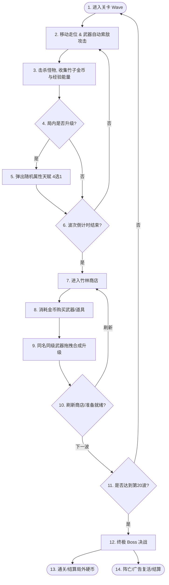

# 《熊猫探险》（Panda Expedition）产品需求文档 (PRD)

## 1. 文档信息

| 项目名称 | 《熊猫探险》（Panda Expedition） |
| --- | --- |
| 文档版本 | v1.0.0 |
| 文档类型 | 产品需求文档（PRD）/ 游戏设计文档（GDD） |
| 对应平台 | iOS / Android（单机，竖屏单手操作） |
| 目标受众 | Roguelite 玩家、割草游戏爱好者、国风萌系IP偏好者 |
| 核心体验 | 爽快割草、流派构建（Build）、单手微操、短平快（10-15分钟/局） |

---

## 2. 游戏概述与核心循环

### 2.1 游戏定位与特色
《熊猫探险》是一款以国宝熊猫为主角的 2D 自上而下（Top-Down）视角的 Roguelite 割草单机手游。游戏结合了《土豆兄弟》（Brotato）的武器多槽合成机制以及《吸血鬼幸存者》（Vampire Survivors）的全屏割草快感，配合清新萌系的国风竹林、熔岩、空岛等美术场景，为玩家提供解压、爽快的轻度策略战斗体验。

### 2.2 核心玩法循环（Core Loop）
游戏以“战斗 - 收集 - 升级 - 交易/合成 - 挑战Boss”为核心循环，单局流程如下：



### 2.3 关卡波次（Wave）时间轴与节奏控制
单局共 20 个波次，波次时长与难度随波次增加呈阶段性上升：

| 阶段 | 波次区间 | 单波时长 | 难度系数 | 阶段定位 | 核心事件 |
| --- | --- | --- | --- | --- | --- |
| **新手期** | 第 1 - 5 波 | 45 秒 | 1.0 ~ 1.5 | 快速成型，熟悉操作 | 初始武器尝试，基础小怪热身 |
| **成长期** | 第 6 - 10 波 | 60 秒 | 1.8 ~ 2.5 | 属性偏转，构建雏形 | 远程/移速怪加入，压力小幅提升 |
| **高潮期** | 第 11 - 19 波 | 75 秒 | 3.0 ~ 5.0 | 极限生存，流派大成 | **第11波、16波的第30秒刷新精英怪** |
| **决战期** | 第 20 波 | 不限时 | 8.0 | 终极试炼，策略检验 | **终极 BOSS 战**（击杀Boss或玩家死亡结束） |

### 2.4 核心战斗与操作机制
* **控制方式**：单手虚拟摇杆控制熊猫移动。
* **攻击方式**：**自动瞄准与开火**。武器在各自的索敌范围（Range）内，自动锁定最近的敌人进行攻击。部分大范围和特殊武器支持全屏或定向轰炸。
* **武器槽位**：每只熊猫默认拥有 **6 个武器槽**，可以同时携带并触发最多 6 件武器。

---

## 3. 玩家基础属性系统

游戏采用高深度的 RPG 属性面板，所有局内升级、武器加成、道具和角色被动均围绕以下 16 个核心属性展开：

| 属性名称 | 英文标识 | 属性说明 | 初始默认值 | 数值边界/收益设计 |
| --- | --- | --- | --- | --- |
| **最大生命值** | HP | 熊猫的生命值上限，归零时游戏结束。 | 100 | 无上限 |
| **生命再生** | HP Regen | 每 5 秒自动恢复的生命值点数。 | 0 | 无上限 |
| **生命偷取** | Life Steal | 攻击命中时，按伤害量的一定比例或概率回复生命值。 | 0% | 建议上限 50% |
| **伤害加成** | Damage | 所有武器造成的最终输出伤害百分比修正。 | 0% | 可为负数 |
| **近战伤害** | Melee DMG | 固定增加近战类武器（如竹棍、大盾、酒壶）的面板伤害。 | 0 | 基础伤害累加值 |
| **远程伤害** | Ranged DMG | 固定增加远程类武器（如青竹弓、扳手）的面板伤害。 | 0 | 基础伤害累加值 |
| **工程学** | Engineering | 影响场上召唤物（如机枪塔、地雷）的伤害和血量。 | 0 | 召唤流核心属性 |
| **攻击速度** | Attack Speed | 缩短所有武器的攻击间隔百分比。 | 0% | 无上限（实际受帧率与动画限制上限） |
| **暴击率** | Critical Chance | 造成双倍（200%）伤害的概率。 | 5% | 上限 100% |
| **移动速度** | Speed | 熊猫走位的移动速度百分比。 | 100% | 建议下限 50%，无上限 |
| **攻击范围** | Range | 增加/缩短武器的索敌距离与碰撞体判定长度。 | 0 | 影响近战与远程的判定圈 |
| **护甲值** | Armor | 减少所受到的伤害，采用收益递减公式计算减伤率。 | 0 | 计算公式见第 10 章 |
| **闪避率** | Dodge | 完全免疫一次任何来源伤害的概率。 | 0% | 常规上限 60%（醉拳大师例外） |
| **幸运值** | Luck | 影响商店刷新高品质物品概率、击杀怪物掉落消耗品率。 | 0 | 无上限 |
| **收获值** | Harvest | 每波结束时，额外免费获得的竹子金币与经验值。 | 0 | 局内理财核心属性 |
| **经验修正** | XP Gain | 改变获取经验值的效率百分比（吸取经验球时的增幅）。 | 0% | 可为负数 |

---

## 4. 初始熊猫角色矩阵

首发提供 6 个具有明显流派偏向的熊猫角色，用于引导玩家构建不同的 Build：

```carousel
### 角色 1：功夫熊猫
* **定位**：近战平衡流
* **属性调整**：
  * HP: +20
  * Melee DMG: +5
  * Speed: +10%
  * Ranged DMG: -10（无法有效使用远程武器）
* **专属被动【借力打力】**：成功闪避敌人攻击时，立刻对周围最近的敌人造成一次等同于 `[近战伤害 * 2]` 的震波伤害（无冷却）。
* **初始武器**：[新手竹棍]

<!-- slide -->

### 角色 2：翠竹射手
* **定位**：远程走位流
* **属性调整**：
  * Ranged DMG: +8
  * Range: +100
  * HP: -15
  * Armor: -2
* **专属被动【百步穿杨】**：距离目标敌人越远，造成的伤害越高。与目标每相距 50 码，伤害提升 5%（最高叠加至 30%）。
* **初始武器**：[青竹弓]

<!-- slide -->

### 角色 3：财迷熊猫
* **定位**：经济理财流
* **属性调整**：
  * Harvest: +20
  * Luck: +15
  * Damage: -10%
* **专属被动【利滚利】**：每波关卡结算时，银行结算利息。身上每拥有 10 金币，额外获得 1 金币收益（单波上限为 50 金币）。
* **初始武器**：[金算盘]

<!-- slide -->

### 角色 4：铁甲霸王
* **定位**：反伤肉盾流
* **属性调整**：
  * Armor: +8
  * HP: +40
  * HP Regen: +5
  * Speed: -15%
* **专属被动【尖刺重甲】**：受到攻击时，将自身护甲值 200% 的固定物理伤害反弹给攻击者。
* **初始武器**：[石制大盾]

<!-- slide -->

### 角色 5：醉拳大师
* **定位**：高闪避爆发流
* **属性调整**：
  * Dodge: +20%
  * Critical Chance: +10%
  * HP Regen: -4
* **专属被动【醉里乾坤】**：闪避率上限提升至 75%。每成功闪避一次伤害，自身攻击速度提升 25%，持续 3 秒（最多叠加 3 层，即 75% 攻速）。
* **初始武器**：[醉拳酒壶]

<!-- slide -->

### 角色 6：机械学者
* **定位**：工程召唤流
* **属性调整**：
  * Engineering: +15
  * Damage: -30% (自身武器伤害减弱)
* **专属被动【流水线生产】**：在地图上每隔 15 秒自动生成一台「青铜竹叶机枪塔」，机枪塔不可移动，继承玩家 100% 的工程学属性。
* **初始武器**：[扳手]
```

---

## 5. 升级路线与武器融合机制

### 5.1 局内等级提升（Level Up）
战斗中击杀怪物掉落“蓝色经验球”，熊猫拾取后累积经验值。升级时游戏暂停，弹出 4 选 1 的属性增益界面。属性品质受 Luck（幸运值）加成：

* **白色（普通）**：提升小额属性（如：HP +3，Melee DMG +1，Attack Speed +2%）。
* **绿色（优秀）**：提升中额属性（如：HP +6，Melee DMG +3，Attack Speed +5%）。
* **蓝色（稀有）**：提升高额属性（如：HP +10，Melee DMG +6，Attack Speed +9%）。
* **紫色（史诗）**：提升巨额属性（如：HP +15，Melee DMG +10，Attack Speed +15%）。

### 5.2 武器升级与融合机制
武器分为 5 个品质等阶：**白色 (Lv.1) $\rightarrow$ 绿色 (Lv.2) $\rightarrow$ 蓝色 (Lv.3) $\rightarrow$ 紫色 (Lv.4) $\rightarrow$ 红色·神话 (Lv.5)**。
* **融合规则**：在商店界面中，拖拽两件**同名且同等级**的武器重叠，即可合成为一件高一等级的同名武器。
* 消耗关系：$2 \times \text{白色} \rightarrow 1 \times \text{绿色}$，依此类推，$16 \times \text{白色} \rightarrow 1 \times \text{红色}$。

```
[白色 Lv.1] + [白色 Lv.1]  ===>  [绿色 Lv.2]
[绿色 Lv.2] + [绿色 Lv.2]  ===>  [蓝色 Lv.3]
[蓝色 Lv.3] + [蓝色 Lv.3]  ===>  [紫色 Lv.4]
[紫色 Lv.4] + [紫色 Lv.4]  ===>  [红色·神话 Lv.5]
```

#### 核心武器数值设计示例：

##### 武器 A：新手竹棍（近战・打击类）
* **白色**：伤害 10，攻击间隔 0.8s，攻击范围 150。击退效果轻微。
* **绿色**：伤害 18，攻击间隔 0.75s，攻击范围 160。
* **蓝色**：伤害 32，攻击间隔 0.7s，攻击范围 180。
* **紫色**：伤害 60，攻击间隔 0.6s，攻击范围 200。攻击附带 10% 概率使敌人眩晕 1 秒。
* **红色（神话品质）**：伤害 120，攻击间隔 0.5s，攻击范围 250。
  * **神话特效**：每次挥动有 30% 概率向前斩出一道半月形竹气波，对路径上的敌人造成等同于武器面板的伤害（最大穿透 5 个敌人）。

##### 武器 B：青竹弓（远程・穿透类）
* **白色**：伤害 8，攻击间隔 0.6s，攻击范围 400。单发普通箭矢。
* **绿色**：伤害 14，攻击间隔 0.55s，攻击范围 430。
* **蓝色**：伤害 24，攻击间隔 0.5s，攻击范围 460。箭矢具备穿透效果（最多穿透 1 个敌人）。
* **紫色**：伤害 45，攻击间隔 0.45s，攻击范围 500。箭矢穿透数提升至 2。
* **红色（神话品质）**：伤害 90，攻击间隔 0.35s，攻击范围 600。
  * **神话特效**：每次攻击变更为扇形“三连发”箭矢，且暴击时触发箭矢分裂（向左右各分裂出 1 支 50% 伤害的追踪小箭）。

---

## 6. 怪物军团设计

怪物分为基础小怪、精英怪（Mini-Boss）和终极 BOSS 三类。

### 6.1 基础小怪数据与 AI

| 怪物名称 | 出现波次 | 基础 HP | 基础伤害 | 移动速度 | 攻击方式与 AI 行为描述 |
| --- | --- | --- | --- | --- | --- |
| **变异毛毛虫** | W1 - W5 | 15 | 3 | 80 | **直线追击**：孵化后缓慢向玩家当前坐标移动，属于基础经验包，无特殊行为。 |
| **疯狂红眼兔** | W3 - W8 | 35 | 5 | 140 | **蓄力跃击**：常规移动慢。进入玩家 200 码范围后会停下蓄力 1 秒（红光提示），随后向玩家当前位置发起高速弹跳撞击。 |
| **毒藤食人花** | W6 - W12 | 80 | 8 | 0 | **远程酸液**：固定无法移动。每 3 秒向玩家抛射一枚毒液弹，落地产生 2 秒酸液区域，熊猫踩入后每秒受 2 点毒属性伤害。 |
| **黑风寨山猪** | W9 - W15 | 220 | 12 | 110 | **霸体冲撞**：血量厚。锁定玩家后进行 2 秒直线高速蓄力冲锋，冲锋期间免疫任何击退。若撞到地图边缘或障碍物会眩晕 1.5 秒。 |
| **竹林刺客猿** | W13 - W19 | 180 | 18 | 160 | **潜行背刺**：周期性进入伪隐身状态（透明度降为 20%）并提升 30% 移速。尝试绕到玩家背后发起高伤害的利爪双击。 |

### 6.2 精英怪（Mini-Boss）
精英怪在第 **11 波** 和第 **16 波** 的第 30 秒准时刷新，击杀必掉「红木宝箱」（可开出随机高阶道具）。

#### 精英怪 A：竹林搬运工・巨力狂猩
* **外观描述**：体型为普通熊猫三倍大，浑身肌肉黑猩猩，背上捆绑着巨型刻字石碑。
* **详细三维**：HP 4,500 | 攻击力 25 | 移动速度 95
* **AI 与招式**：
  1. **【泰山压顶】**：双拳重锤地面，向正前方扇形区域扩散三条裂地波，击中玩家造成伤害并附加 30% 减速效果，持续 3 秒。
  2. **【巨石投掷】**：当玩家距离大于 300 码时，从背部拔出石块砸向玩家，落地碎裂为 4 块向斜向飞散的碎石（造成半额伤害）。

#### 精英怪 B：沼泽魅影・百足蜈蚣
* **外观描述**：多节青铜机关外壳组成的机械百足巨虫，贴地快速滑行。
* **详细三维**：HP 7,000 | 攻击力 30 | 移动速度 130
* **AI 与招式**：
  1. **【毒雾环绕】**：滑行轨迹上遗留紫色毒雾，持续 4 秒。玩家触碰会获得持续掉血 Debuff。
  2. **【死亡绞杀】**：当蜈蚣通过蛇形走位成功将玩家合围在圈内时，立刻收缩身躯，对包围圈内的所有空间引发一次全屏伤害判定的爆炸。

### 6.3 终极 BOSS (第 20 波)
第 20 波为无时间限制决战，击杀 BOSS 即通关。关卡随机选择以下两位 BOSS 之一：

#### 终极 BOSS 1：【贪婪饕餮・邪化暴君】
* **设计概念**：因偷吃禁忌神魔竹笋而被魔气侵蚀的远古巨兽。
* **属性数据**：HP 50,000 | 攻击力 45 | 移动速度 110
* **技能机制**：
  * **阶段一（100% - 50% HP）**：
    * **【暴食黑洞】**：BOSS跳至地图中央张开巨口产生极强吸力，全屏玩家持续被往中心拉扯，玩家需朝反方向奔跑。吸力期间天空掉落毒苹果（红圈示警）。
    * **【邪能践踏】**：重踏地面，全图随机降下 8 个陨石，造成范围伤害。
  * **阶段二（<50% HP 狂暴）**：
    * **外观变化**：双眼赤红，身体开裂流出金色岩浆。**移动速度提升 25%，技能 CD 缩短 30%**。
    * **【毁灭横扫】**：拔出图腾柱在身前进行 180 度超大范围半圆横扫，仅 BOSS 背后和极限距离安全。

#### 终极 BOSS 2：【机关核心・九天青龙】
* **设计概念**：墨家机关术制造的巨型发光机械木龙，围绕地图外圈高频游走。
* **属性数据**：HP 65,000 | 攻击力 35 | 移动速度 150
* **技能机制**：
  * **阶段一（100% - 60% HP）**：
    * **【万箭齐发】**：背部机关打开，射出 60 发追踪导弹。导弹飞行速度慢，但会强力追踪玩家 2 秒，需要玩家通过 90 度急转走位甩开。
    * **【雷霆电网】**：在地图上射出 4 条纵横交错的电光网，分割战场限制走位，并在分割出的安全区内持续刷出小怪。
  * **阶段二（<60% HP 核心超载）**：
    * **【烈焰风暴】**：机械龙盘踞在地图边缘，龙头对准中央开始喷射 300 码的长条持续烈焰，并做顺时针/逆时针缓慢旋转。玩家必须跟着火焰旋转方向进行“二人转”同步走位避险。

---

## 7. 道具库与装备生态设计（40款道具）

道具为玩家的核心 Build 提供变化。品质分为：**白（普通）**、**绿（优秀）**、**蓝（稀有）**、**紫（传说）**。道具多采用“正面增益 + 负面代价”的设计，以丰富玩家的抉择。

### 7.1 白色道具（基础成长，共 15 款）

| ID | 道具名称 | 品质 | 属性增益（正面效果） | 属性减益（负面效果）/ 备注 |
| --- | --- | --- | --- | --- |
| 1 | **老旧的沙袋** | 白色 | HP +10 | Speed -2% |
| 2 | **磨刀石** | 白色 | Melee DMG +3 | Ranged DMG -1 |
| 3 | **羽毛箭翎** | 白色 | Ranged DMG +3 | Range +20 |
| 4 | **防弹背心** | 白色 | Armor +2 | Critical Chance -1% |
| 5 | **跑鞋** | 白色 | Speed +5% | 无 |
| 6 | **幸运四叶草** | 白色 | Luck +8 | 无 |
| 7 | **存钱罐** | 白色 | Harvest +5 | 无 |
| 8 | **劣质红药水** | 白色 | HP Regen +2 | Damage -2% |
| 9 | **吸血蝙蝠牙** | 白色 | Life Steal +2% | 无 |
| 10 | **放大镜** | 白色 | Critical Chance +4% | 无 |
| 11 | **小齿轮** | 白色 | Engineering +4 | 无 |
| 12 | **坏掉的怀表** | 白色 | Attack Speed +5% | 无 |
| 13 | **智慧药水** | 白色 | XP Gain +8% | 无 |
| 14 | **增高鞋垫** | 白色 | Range +30 | 无 |
| 15 | **铁钉皮带** | 白色 | Melee DMG +2, Life Steal +1% | 无 |

### 7.2 绿色道具（属性偏转，共 12 款）

| ID | 道具名称 | 品质 | 属性增益（正面效果） | 属性减益（负面效果）/ 备注 |
| --- | --- | --- | --- | --- |
| 16 | **巨大空心竹筒**| 绿色 | HP +25, HP Regen +4 | Speed -5% |
| 17 | **刺客面具** | 绿色 | Critical Chance +8%, Dodge +5%| HP -6 |
| 18 | **重型火药** | 绿色 | Ranged DMG +8, Range +40 | Attack Speed -6% |
| 19 | **合金扳手** | 绿色 | Engineering +10, HP +5 | Melee DMG -3 |
| 20 | **黄金算盘** | 绿色 | Harvest +15 | 每次刷新商店（Reroll）消耗金币少 2 |
| 21 | **备用电池** | 绿色 | 工程召唤物攻速 +20% | 玩家自身 Damage -5% |
| 22 | **急救绷带** | 绿色 | HP Regen +6 | 自身 HP 低于 30% 时，HP Regen 效果翻倍 |
| 23 | **神速马靴** | 绿色 | Speed +12% | Armor -2 |
| 24 | **荆棘背心** | 绿色 | Armor +4 | 受到攻击时，对攻击者造成 10 点反伤 |
| 25 | **强光手电** | 绿色 | Range +80 | 攻击附带致盲，敌人攻击未命中率提升 5% |
| 26 | **高蛋白竹笋** | 绿色 | HP +15, Damage +5% | 无 |
| 27 | **幸运猫爪** | 绿色 | Luck +20 | 局内怪物掉落消耗品/药水概率提升 10% |

### 7.3 蓝色道具（流派核心，共 8 款）

| ID | 道具名称 | 品质 | 属性增益（正面效果） | 属性减益（负面效果）/ 备注 |
| --- | --- | --- | --- | --- |
| 28 | **狂战士药剂** | 蓝色 | Damage +20%, Life Steal +5% | 局内每受一次伤害，后续受到的伤害增加 1% |
| 29 | **墨家机关核心**| 蓝色 | Engineering +20 | 场上每存活一台炮台，玩家 Armor +1 |
| 30 | **巨浪护腕** | 蓝色 | 近战武器攻击范围 +30% | 近战攻击附带击退冲击波，击退距离显著增加 |
| 31 | **幽灵披风** | 蓝色 | Dodge +15% | 成功闪避伤害后，下一次攻击必定触发 300% 暴击 |
| 32 | **财富重担** | 蓝色 | 每存有 100 金币，Damage +3%（上限30%）| Speed -2% |
| 33 | **量子加速器** | 蓝色 | Attack Speed +30% | Melee DMG -5, Ranged DMG -5 |
| 34 | **吸血鬼披风** | 蓝色 | Life Steal +10% | 满血时，吸血溢出的生命值转化为护盾（最高50）|
| 35 | **指南针** | 蓝色 | 地图全亮 | 每波开始时标记一个“黄金泉”，站立 5s 获 50 金币 |

### 7.4 紫色传说道具（改天换命，共 5 款）

#### 36. 【传世武籍・易筋经】
* **属性增益**：最大生命值 +50，生命再生 +15，护甲值 +10。
* **致命代价**：**玩家无法携带或使用任何远程武器**（所有远程武器槽禁用，强行锁定近战流派）。

#### 37. 【九转还魂丹】
* **属性增益**：生命值归零时，原地复活并恢复 50% 生命值。
* **特殊特效**：复活时触发 3 秒全屏无敌并释放强力击退震波（每局游戏限 1 次）。

#### 38. 【核能竹子反应堆】
* **属性增益**：伤害加成 +40%。
* **特殊特效**：攻击有 25% 概率触发“连锁闪电”，在最多 5 个敌人之间弹跳，造成等额远程伤害。

#### 39. 【点金神手】
* **属性增益**：收获值 +50。
* **特殊特效**：击杀任何怪物时，均有 5% 的概率使该怪物直接转化为一锭黄金（拾取直接获得 10 金币）。

#### 40. 【虚空之眼】
* **属性增益**：全场敌人移动速度永久下降 15%。
* **特殊特效**：获得空间跃迁能力：每隔 10 秒，在受到伤害的一瞬间，会自动向随机安全方向瞬移 200 码（完美躲避该次伤害）。

---

## 8. 地图与场景环境系统

| 地图 ID & 名称 | 适用波次 | 尺寸 (像素) | 视觉风格 | 特色机关与地形交互机制 |
| --- | --- | --- | --- | --- |
| **地图 1：幽静翠竹林** | W1 - W5 | $3000 \times 3000$ | 阳光斑驳竹林、青苔泥地、死角木围栏 | **密集竹丛**：地图上随机分布，阻挡视线。玩家和怪物均可穿过，穿过时**移速减缓 20%**。可用作风筝高移速小怪。 |
| **地图 2：熔岩地下城** | W6 - W15 | $4000 \times 4000$ | 黑火山岩石、流淌的红浆沟壑、宽阔空地 | **间歇泉喷发口**：每 20 秒在地面产生红圈预警，1.5 秒后喷出岩浆，对覆盖区域内的所有单位（包括玩家和怪物）造成**每 0.5 秒 20 点的真实伤害**。 |
| **地图 3：太极悬浮空岛**| W16 - W20 | $2500 \times 2500$ | 缭绕仙雾云海、太极八卦浮空石阵 | **深渊边缘**：无空气墙。若玩家坠落边缘，扣除 20% 最大生命值并被传回中央。<br>**太极阴阳眼**：中央有巨大的黑白太极眼，站立于**白色阳眼**中：Attack Speed +30% 且 Armor 降为 0；站立于**黑色阴眼**中：Armor +20 且 Damage -50%。 |

---

## 9. 商业化与变现设计

作为一款单机向 Roguelite 游戏，商业化采用 **混合变现模式（IAP + IAA）**，旨在不破坏单机游戏纯粹体验的前提下，确保高变现效率。

```
                                  +---------------------------------------+
                                  |            混合变现系统设计            |
                                  +-------------------+-------------------+
                                                      |
                    +---------------------------------+---------------------------------+
                    |                                                                   |
                    v                                                                   v
      +---------------------------+                                       +---------------------------+
      |       广告变现 (IAA)       |                                       |       内购项目 (IAP)       |
      +-------------+-------------+                                       +-------------+-------------+
                    |                                                                   |
         +----------+----------+                                             +----------+----------+
         |                     |                                             |                     |
         v                     v                                             v                     v
   [局后翻倍收益]        [每局1次免费复活]                                 [精美皮肤/特效直购]    [终身免广告通行证]
 (观看30s广告使局外    (看广告复活并获得                                 (限定国风熊猫皮肤、    (售价18-28元, 永久
  成长硬币获取翻倍)    3s无敌与50%血量)                                  神话武器外观等)        免广告获得全部翻倍)
```

1. **广告变现（IAA）**：
   * **结算双倍**：每局结束后（无论是通关还是中途死亡），玩家可点击观看 30 秒视频广告，使结算获得的局外成长硬币翻倍。
   * **广告复活**：每局比赛有且仅有 1 次复活机会，可以通过观看 30 秒广告实现原地半血复活。
2. **内购项目（IAP）**：
   * **去广告通行证**：定价为 18 ~ 28 元。购买后自动跳过所有视频广告，直接获取复活和双倍结算奖励。
   * **皮肤/特效直购**：设计如“齐天大圣熊猫”、“熊猫高达”等国风皮肤，改变外观与受击特效，提供轻度收集价值（不包含改变平衡性的核心战斗属性）。

---

## 10. 数值平衡底层公式

开发期必须严格遵守以下底层数学公式，确保数值可控、难度合理。

### 10.1 伤害减免公式 (Armor Calculation)
护甲提供的减伤率呈对数衰减，避免玩家堆叠护甲达到 100% 减伤从而无敌。

$$\text{减伤率 (Damage Reduction)} = \frac{\text{Armor}}{\text{Armor} + 15}$$

$$\text{真实承受伤害 (Actual DMG)} = \text{Monster DMG} \times \left(1 - \text{减伤率}\right) = \text{Monster DMG} \times \left(1 - \frac{\text{Armor}}{\text{Armor} + 15}\right)$$

* **数值参考**：
  * 护甲为 $15$ 时，减伤为 $\frac{15}{30} = 50\%$。
  * 护甲为 $45$ 时，减伤为 $\frac{45}{60} = 75\%$。
  * 护甲为 $135$ 时，减伤为 $\frac{135}{150} = 90\%$。

### 10.2 升级所需经验公式 (XP Requirements)
控制前期升级极快以迅速确立流派，后期升级放缓限制无限变强：

$$\text{Required XP}(\text{Level}) = 5 + (\text{Level} \times 3) + (\text{Level}^2 \times 0.5)$$

* **数值参考**：
  * Lv.1 $\rightarrow$ Lv.2：$5 + 3 + 0.5 = 8.5$（向上取整为 9）
  * Lv.10 $\rightarrow$ Lv.11：$5 + 30 + 50 = 85$
  * Lv.20 $\rightarrow$ Lv.21：$5 + 60 + 200 = 265$

### 10.3 商店商品重置费用公式 (Reroll Cost)
防止玩家在单波无限 Reroll 寻找神装，使玩家必须接受肉鸽的随机性：

$$\text{Reroll Cost} = 1 + \left\lfloor \frac{\text{Current Wave}}{2} \right\rfloor + (\text{本波刷新次数} \times 1)$$

* **数值参考（以第 10 波为例，基础刷新费用为 $1 + 5 = 6$）**：
  * 第 1 次刷新：6 金币
  * 第 2 次刷新：7 金币
  * 第 3 次刷新：8 金币

---

## 11. 敏捷开发路线与架构设计建议

### 11.1 敏捷开发三步走建议
为确保开发可控，建议开发者分阶段进行敏捷迭代：


1. **Phase 1：核心战斗与手感调优（1-2周）**
   * 创建一个测试熊猫角色，1 个小怪（如变异毛毛虫），2 把基础武器（新手竹棍、青竹弓）。
   * 在纯白盒地图上跑通：**移动走位 - 自动索敌 - 击中伤害反馈 - 击杀怪物 - 掉落吸取硬币与经验**。
2. **Phase 2：属性系统与交易闭环（1-2周）**
   * 实现第 3 章的 16 个核心属性框架，使属性变更能直接映射到伤害计算和熊猫移动。
   * 开发商店系统、局内升级 4 选 1 弹窗以及同名同级武器的拖拽合成逻辑。
3. **Phase 3：内容填充与商业化上线（2-3周）**
   * 逐步导入 6 个角色、40 个道具的数据字典，实现其余怪物与 BOSS 的 AI 招式。
   * 实现 3 个地图的独特机关逻辑以及去广告、插屏广告等变现 SDK 的对接。

### 11.2 游戏架构数据模型参考 (Cocos / Unity / TS)

#### 11.2.1 玩家属性模型
```typescript
interface PlayerAttributes {
    hpMax: number;          // 最大生命值
    hpRegen: number;        // 生命再生 (每5秒恢复)
    lifeSteal: number;      // 生命偷取 (%)
    damageModifier: number; // 伤害加成 (%)
    meleeDmg: number;       // 近战伤害
    rangedDmg: number;      // 远程伤害
    engineering: number;    // 工程学
    attackSpeed: number;    // 攻击速度 (%)
    critChance: number;     // 暴击率 (%)
    speed: number;          // 移动速度 (%)
    range: number;          // 攻击范围
    armor: number;          // 护甲值
    dodge: number;          // 闪避率 (%)
    luck: number;           // 幸运值
    harvest: number;        // 收获值
    xpGainModifier: number; // 经验修正 (%)
}
```

#### 11.2.2 武器数据模型
```typescript
enum WeaponQuality {
    WHITE = 1,
    GREEN = 2,
    BLUE = 3,
    PURPLE = 4,
    RED = 5
}

interface WeaponData {
    id: string;             // 武器ID
    name: string;           // 武器名称
    quality: WeaponQuality; // 品质
    baseDamage: number;     // 基础伤害
    attackInterval: number; // 攻击间隔 (秒)
    attackRange: number;    // 索敌攻击范围 (像素)
    isMelee: boolean;       // 是否为近战武器
    mythicEffect?: Function;// 红色品质时的特殊神话特效
}
```

#### 11.2.3 道具数据模型
```typescript
interface ItemData {
    id: number;             // 道具ID
    name: string;           // 道具名称
    quality: WeaponQuality; // 品质
    modifiers: Partial<PlayerAttributes>; // 该道具对玩家属性的影响字典
    uniqueEffect?: Function;// 特殊或传说道具的定制触发函数
}
```
