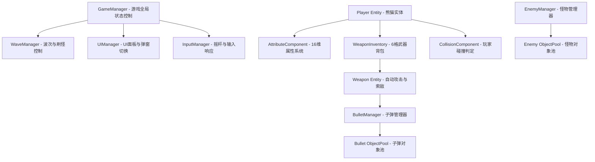

# 《熊猫探险》（Panda Expedition）技术设计文档 (TDD)

## 1. 系统架构设计

本游戏推荐采用**组件化架构 (Component-Based)** 配合 **单例管理器 (Manager Pattern)** 的模式进行开发（如 Cocos Creator 或 Unity Component 模式）。针对 Roguelite 割草游戏中同屏单位多、状态计算频密的特点，设计合理的实体层与逻辑层解耦。

### 1.1 核心架构拓扑图



---

## 2. 核心系统技术实现

### 2.1 动态属性与修饰器系统 (Attribute & Modifier System)
Roguelite 游戏中有大量的道具和局内升级会动态修改玩家的属性。直接修改基础属性容易导致属性计算混乱且不可逆。

#### 技术设计：
采用 **基础值 (Base Value) + 修饰器 (Modifier)** 的方式。修饰器分为**加法修饰**和**乘法修饰**。
计算公式如下：

$$\text{最终值} = (\text{基础值} + \sum \text{加法修正}) \times (1 + \sum \text{乘法修正})$$

#### TypeScript 代码实现：

```typescript
// 属性修饰器结构
export interface AttributeModifier {
    id: string;             // 修饰器来源 (如: "item_3", "level_up_hp")
    addVal: number;         // 加法改变量
    mulVal: number;         // 乘法改变量 (百分比，例如 0.1 代表 +10%)
}

// 属性容器类
export class ObservableAttribute {
    private baseValue: number = 0;
    private modifiers: Map<string, AttributeModifier> = new Map();
    private dirty: boolean = true;
    private cachedValue: number = 0;

    constructor(base: number) {
        this.baseValue = base;
        this.dirty = true;
    }

    public get value(): number {
        if (this.dirty) {
            this.cachedValue = this.calculateValue();
            this.dirty = false;
        }
        return this.cachedValue;
    }

    public addModifier(mod: AttributeModifier): void {
        this.modifiers.set(mod.id, mod);
        this.dirty = true;
    }

    public removeModifier(id: string): void {
        if (this.modifiers.delete(id)) {
            this.dirty = true;
        }
    }

    private calculateValue(): number {
        let totalAdd = 0;
        let totalMul = 0;
        this.modifiers.forEach(mod => {
            totalAdd += mod.addVal;
            totalMul += mod.mulVal;
        });
        return (this.baseValue + totalAdd) * (1 + totalMul);
    }
}
```

---

### 2.2 自动索敌与开火逻辑 (Auto-Aiming & Fire System)
熊猫身上最多携带 6 件武器，每件武器有独立的计时器（Timer）和索敌范围（Range）。

#### 技术设计：
1. **定时索敌**：武器不应在每帧都进行全图距离计算（消耗 CPU 资源）。应利用定时器（如每 0.1 秒）或利用物理引擎的触发器 `Collider` 维护一个**在围内怪物列表 (EnemiesInRange)**。
2. **选择目标**：从列表中选择距离最近的怪物作为目标，并调整武器方向旋转指向目标。
3. **开火判定**：如果攻击冷却完毕，生成对应的子弹/攻击判定体。

#### 核心伪代码：
```typescript
export class WeaponComponent {
    public range: number = 200;
    public attackInterval: number = 0.8;
    private cooldownTimer: number = 0;
    private targetEnemy: any = null;

    update(dt: number) {
        if (this.cooldownTimer > 0) {
            this.cooldownTimer -= dt;
        }

        // 寻找最近目标
        this.targetEnemy = this.findNearestEnemy();

        if (this.targetEnemy && this.cooldownTimer <= 0) {
            this.fire(this.targetEnemy);
            this.cooldownTimer = this.attackInterval;
        }
    }

    private findNearestEnemy(): any {
        const enemies = EnemyManager.getInstance().getActiveEnemies();
        let nearest: any = null;
        let minDist = this.range;

        for (let enemy of enemies) {
            let dist = this.node.position.subtract(enemy.node.position).length();
            if (dist < minDist) {
                minDist = dist;
                nearest = enemy;
            }
        }
        return nearest;
    }

    private fire(target: any) {
        // 从对象池获取子弹并初始化
        const bullet = BulletManager.getInstance().getBulletFromPool();
        bullet.spawn(this.node.position, target.node.position, this.getDamage());
    }
}
```

---

### 2.3 商店武器网格与融合算法 (Weapon Merging Algorithm)
两件相同名字且相同品质的武器可以融合升级为更高品质。

#### 数据层定义：
武器背包可以使用一个固定长度为 6 的数组表示，每个槽位存放 `WeaponItem` 对象。

```typescript
export interface WeaponItem {
    slotIndex: number;      // 槽位索引 (0 - 5)
    weaponId: string;       // 武器ID (如 "bamboo_stick")
    quality: number;        // 品质 (1 - 5)
}
```

#### 拖拽与合并判定算法：
当拖拽网格 A 的武器到网格 B 时，判定逻辑如下：

```typescript
export class InventoryManager {
    private slots: (WeaponItem | null)[] = new Array(6).fill(null);

    public tryMerge(fromIndex: number, toIndex: number): boolean {
        const fromItem = this.slots[fromIndex];
        const toItem = this.slots[toIndex];

        if (!fromItem || !toItem) return false;

        // 必须同名且同品质，并且未达到红色神话（Quality 5）
        if (fromItem.weaponId === toItem.weaponId && fromItem.quality === toItem.quality && toItem.quality < 5) {
            // 升级目标网格
            toItem.quality += 1;
            // 清空起始网格
            this.slots[fromIndex] = null;
            
            this.dispatchInventoryUpdate();
            return true;
        }

        // 否则仅做普通交换位置
        this.swap(fromIndex, toIndex);
        return false;
    }

    private swap(fromIndex: number, toIndex: number) {
        const temp = this.slots[fromIndex];
        this.slots[fromIndex] = this.slots[toIndex];
        this.slots[toIndex] = temp;
        this.dispatchInventoryUpdate();
    }
}
```

---

### 2.4 怪物波次与 AI 控制器 (Wave & Spawner System)
波次控制使用 JSON 格式配置进行驱动，方便后期运营调优。

#### 刷怪配置 JSON 设计示例：
```json
{
  "wave": 6,
  "duration": 60,
  "spawnRules": [
    {
      "enemyId": "mutant_caterpillar",
      "interval": 2.0,
      "countPerSpawn": 5,
      "startTime": 0
    },
    {
      "enemyId": "poison_flower",
      "interval": 5.0,
      "countPerSpawn": 2,
      "startTime": 15
    }
  ]
}
```

#### 怪物 AI 行为树/状态机 (FSM)：
怪物基类（`EnemyBase`）包含通用状态，利用简单有限状态机实现状态切换：

* **Idle (待机)**：生成时的初始缓冲状态。
* **Chase (追击)**：获取玩家当前坐标并计算朝向，以速度（Speed）进行直线位移。
* **SkillCharge (蓄力)**：如“红眼兔”、“山猪”、“巨力狂猩”，在技能释放前进行闪红预警，暂停追击。
* **ExecuteSkill (释放技能)**：执行物理冲撞、抛射酸液或地裂波逻辑。
* **Stun (眩晕)**：受山猪撞墙或玩家武器控制技能影响，1.5 秒内无法执行其他状态。

---

## 3. 物理与碰撞设计 (Collision Layers)

为保证高效的碰撞检测，必须严谨划分物理碰撞矩阵：

### 3.1 碰撞层级 (Layer Matrix)

| 碰撞层 (Layer) | 玩家 (Player) | 玩家子弹 (PlayerBullet) | 怪物 (Enemy) | 怪物子弹 (EnemyBullet) | 收集物 (Collectables) | 障碍物 (Obstacles) |
| --- | --- | --- | --- | --- | --- | --- |
| **Player** | - | - | **Yes (受击)** | **Yes (受击)** | **Yes (拾取)** | **Yes (阻挡)** |
| **PlayerBullet**| - | - | **Yes (伤害)** | - | - | **Yes (消散)** |
| **Enemy** | **Yes** | **Yes** | - | - | - | **Yes (阻挡)** |
| **EnemyBullet** | **Yes** | - | - | - | - | **Yes (消散)** |
| **Collectables**| **Yes** | - | - | - | - | - |
| **Obstacles** | **Yes** | **Yes** | **Yes** | **Yes** | - | - |

---

## 4. 关键性能优化方案 (Performance Optimizations)

割草游戏（同屏 500+ 单位）的主要性能瓶颈在于：**CPU 物理碰撞计算过多**、**内存频繁申请释放导致 GC 卡顿**、**GPU DrawCall 过高**。

### 4.1 对象池技术 (Object Pooling)
子弹、怪物死亡金币、血条飘字等必须使用对象池，严禁在运行时频繁调用 `instantiate` / `new` 和 `destroy`。

#### 对象池管理基类：
```typescript
export class ObjectPool<T> {
    private pool: T[] = [];
    private factory: () => T;
    private resetFunc: (obj: T) => void;

    constructor(factory: () => T, reset: (obj: T) => void) {
        this.factory = factory;
        this.resetFunc = reset;
    }

    public get(): T {
        if (this.pool.length > 0) {
            return this.pool.pop()!;
        }
        return this.factory();
    }

    public put(obj: T): void {
        this.resetFunc(obj);
        this.pool.push(obj);
    }
}
```

### 4.2 场景空间分割算法 (Quadtree - 四叉树)
当场上存活数百只怪物时，如果每个子弹都与全图怪物做遍历距离计算（时间复杂度 $O(N^2)$），游戏会发生严重卡顿。
* **优化策略**：使用 **四叉树（Quadtree）** 空间分割算法。每帧将所有怪物的坐标写入四叉树中，子弹索敌或碰撞检测时，仅向四叉树查询自己周围一定范围内的“邻居怪物”，将复杂度降至 $O(N \log N)$。

### 4.3 渲染优化 (Rendering Optimization)
* **动态合图 (Dynamic Atlas)**：将游戏中所有熊猫皮肤、怪物序列帧、子弹图标、特效打包进统一的纹理集 (Texture Atlas)，确保同屏渲染时的 **DrawCall 控制在 50 以下**。
* **文字批处理 (Batching Label)**：飘字（伤害数值）使用位图字体 (BMFont)，开启共享渲染批处理，防止海量数字飘字造成渲染瓶颈。

---

## 5. 数据持久化设计 (Save/Load & Progression)

游戏虽为单机，但存在局外永久成长属性和皮肤解锁，需使用本地加密存储（如 `LocalStorage` + `AES加密`）。

### 5.1 本地存档数据结构 (Save Profile)

```json
{
  "currency": {
    "coin": 1250,              // 局外强化使用的金币
    "premiumToken": 10          // 充值或特殊活动获得的代币
  },
  "unlockedPandas": [
    "kungfu_panda",
    "bamboo_archer"
  ],
  "currentEquippedSkin": "kungfu_panda_default",
  "permanentUpgrades": {
    "hpLevel": 3,              // 局外永久生命值等级 (+15)
    "damageLevel": 2,          // 局外永久攻击力提升等级 (+6%)
    "armorLevel": 1            // 局外永久护甲等级 (+2)
  },
  "settings": {
    "soundVolume": 0.8,
    "musicVolume": 0.5,
    "vibrationEnabled": true
  },
  "isNoAds": false             // 永久免广告凭证
}
```
